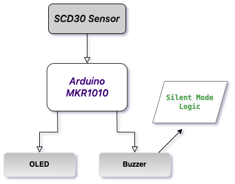

# Indoor Environment Comfort Monitoring System✨

A system designed to monitor indoor air quality and provide real-time feedback to ensure a comfortable and healthy environment. This project utilizes sensors, an OLED display, and a buzzer to monitor and alert users of CO₂ concentration levels while displaying temperature and humidity data.

---

## Features

- **Real-time Monitoring**: Measures CO₂, temperature, and humidity using the SCD30 sensor.
- **Visual Feedback**: Displays sensor readings on an OLED screen.
- **Auditory Alerts**:
  - **Short Beep**: CO₂ levels exceed 1000 ppm (moderate alert).
  - **Long Beep**: CO₂ levels exceed 2000 ppm (high alert).
- **Silent Mode**: Reduces disturbance by activating after repeated alarms.
- **User-Friendly Design**: Compact system with clear feedback mechanisms.

---

## System Workflow

1. **Data Collection**:
   - The SCD30 sensor collects CO₂ concentration, temperature, and humidity.
2. **Data Processing**:
   - The Arduino UNO processes the sensor data.
3. **User Alerts**:
   - Audible alarms (buzzer) and real-time visualizations (OLED display).
4. **Safety Mechanism**:
   - Silent mode activates after a certain number of alarms to prevent unnecessary disturbances.

---

## Components

- **Sensors**:
  - **SCD30**: Measures CO₂, temperature, and humidity with high accuracy.
- **Display**:
  - **Adafruit SSD1306 OLED**: Displays sensor readings in a clear and concise format.
- **Buzzer**:
  - Provides auditory feedback for air quality alerts.
- **Microcontroller**:
  - Arduino UNO.
 

---

## Setup and Installation

1. **Hardware Setup**:
   - Connect the SCD30 sensor to the Arduino UNO via I²C interface.
   - Connect the OLED display using the specified I²C pins.
   - Attach the buzzer to pin 6 on the Arduino.

2. **Software Setup**:
   - Install the required libraries:
     - `Adafruit_SCD30`
     - `Adafruit_SSD1306`
   - Upload the provided code to the Arduino using the Arduino IDE.

---

## Code Highlights

- **CO₂ Monitoring**:
  - Short beep for levels >1000 ppm, long beep for levels >2000 ppm.
- **Silent Mode**:
  - Activates after 5 alarms, with a reset cooldown of 5 minutes.
- **OLED Visualization**:
  - Displays temperature, humidity, and CO₂ concentration.

---

## Usage

1. Power on the system.
2. Observe real-time data on the OLED screen.
3. Respond to auditory alerts for high CO₂ levels:
   - Ensure ventilation if alerts are triggered.
4. Silent mode activates automatically after repeated alarms.

---

## Future Development

- **Additional Sensors**:
  - Include VOCs and PM2.5 sensors for comprehensive air quality monitoring.
- **Remote Monitoring**:
  - Integrate wireless connectivity (e.g., MQTT) for data visualization on mobile apps.
- **Customizable Alerts**:
  - Allow users to set thresholds and notification preferences.

---

## Author

**Yue Zhu**  
UCL CASA0016  
[GitHub Repository](https://github.com/XLunaXX07/CASA0016.0)
email📧：ucfnyz3@ucl.ac.uk

---

## Notes

For detailed code explanations and system demonstration, refer to the repository files.
